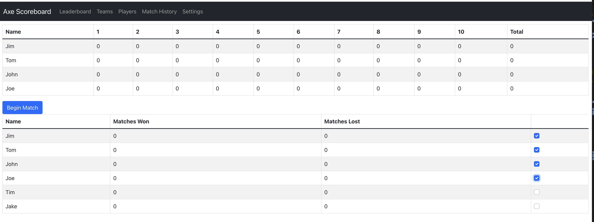

# Axe Scoreboard

## Overview
This application is intended for use as an axe throwing scoreboard for home axe throwers.

## Getting Started

### Prerequisites
node v18.14.0

### Installation
`git clone https://github.com/brian-thornton/axe-scoreboard`\
`cd axe-scoreboard`\
`npm install`\
`npm start`