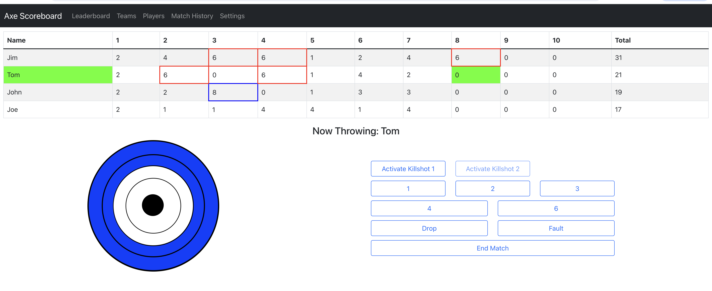
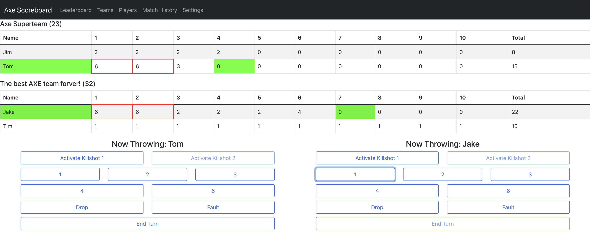
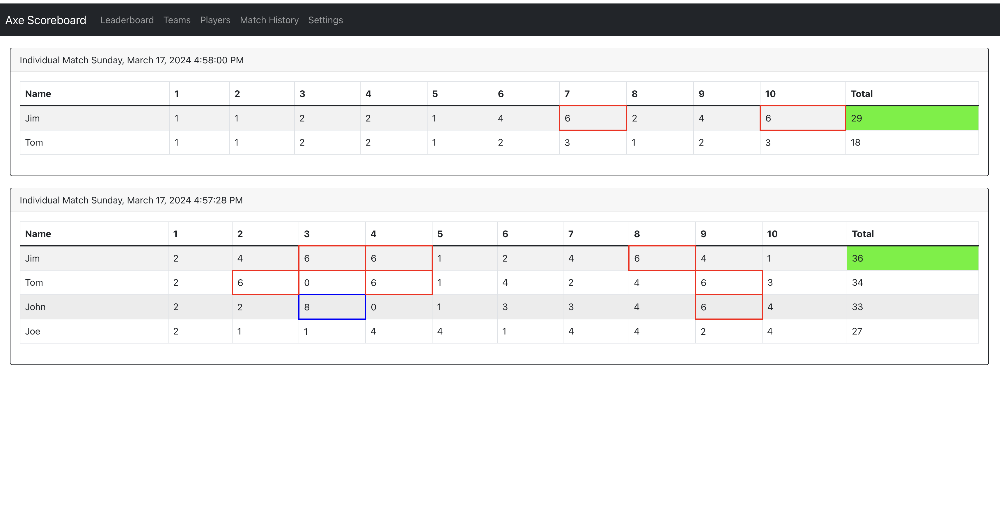

# Axe Scoreboard

## Overview
This application is intended for use as an axe throwing scoreboard for home axe throwers.

### Individual Match

### Team Match

### Match History

## Getting Started

You can access the axe scoreboard at https://axe-scoreboard.vercel.app/ or install and run locally using the instructions below.

### Prerequisites
node v18.14.0

### Installation
`git clone https://github.com/brian-thornton/axe-scoreboard`\
`cd axe-scoreboard`\
`npm install`\
`npm start`

### Notes
NOTE: All data is stored in browser localStorage. If you clear your browser cache all match history and player data will be LOST. 

